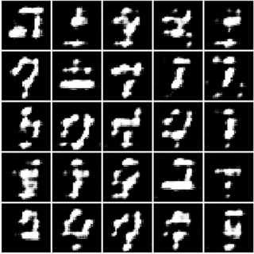
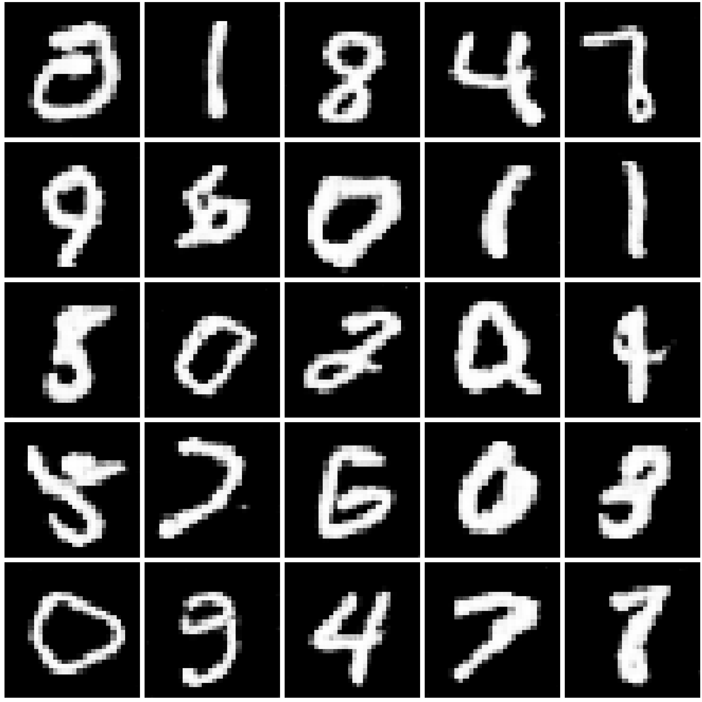
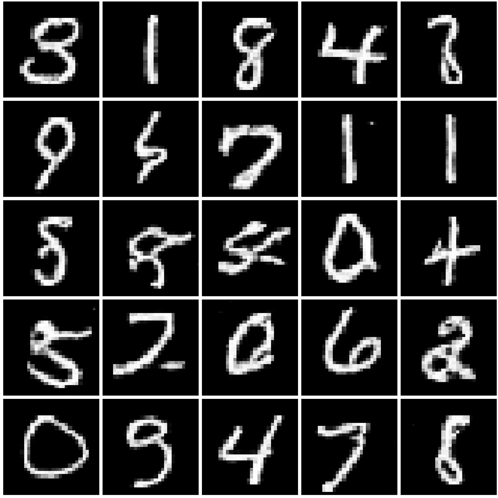
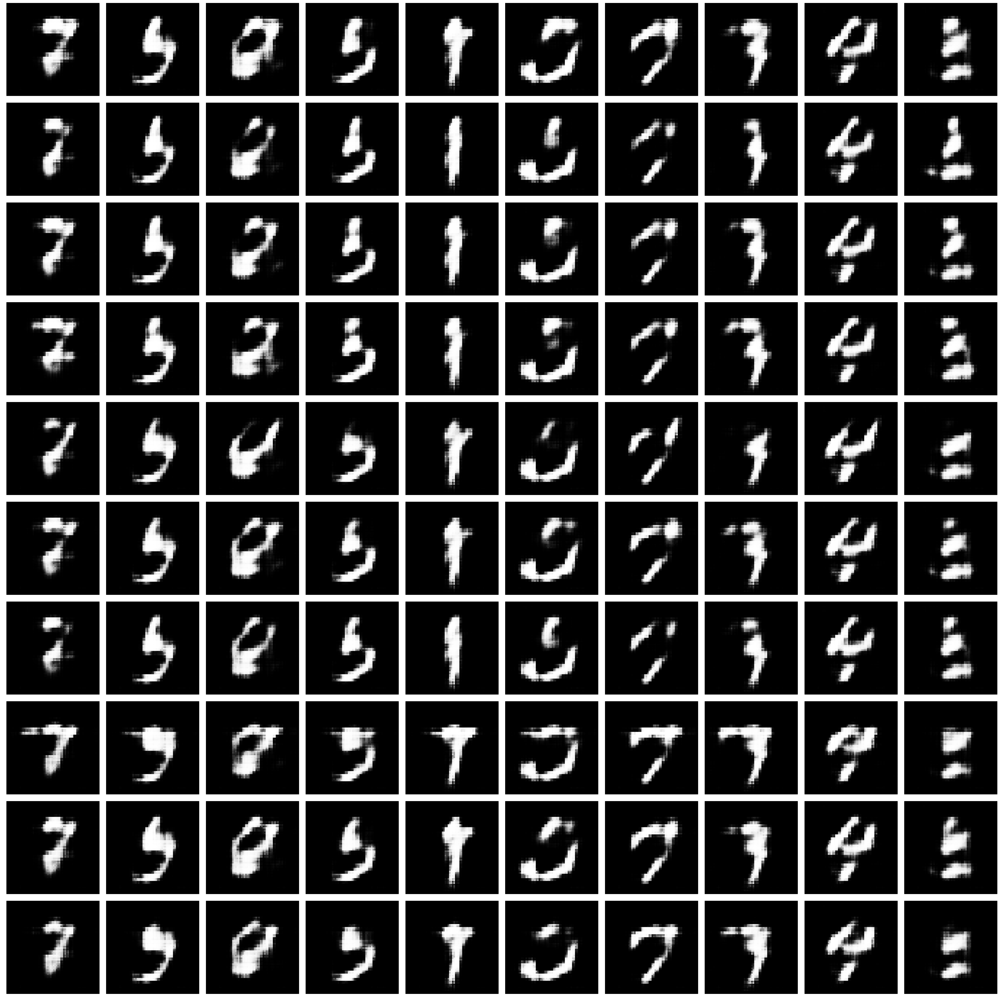
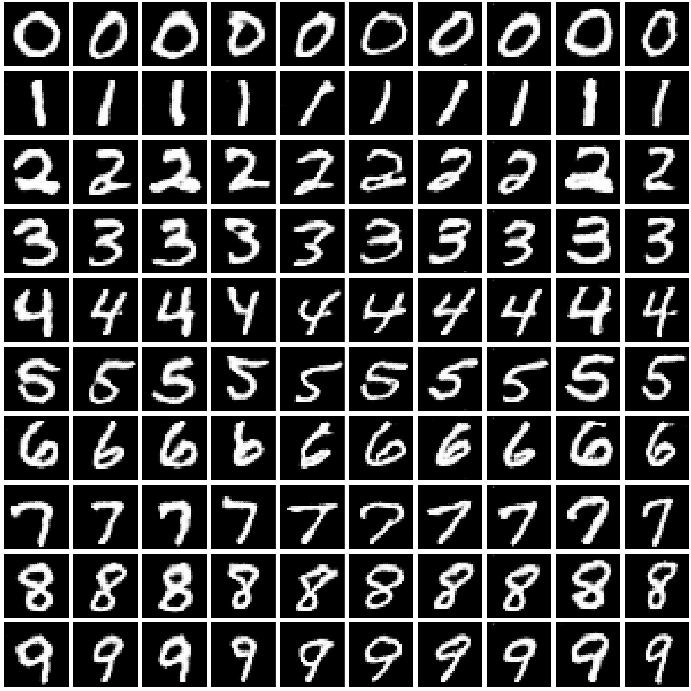
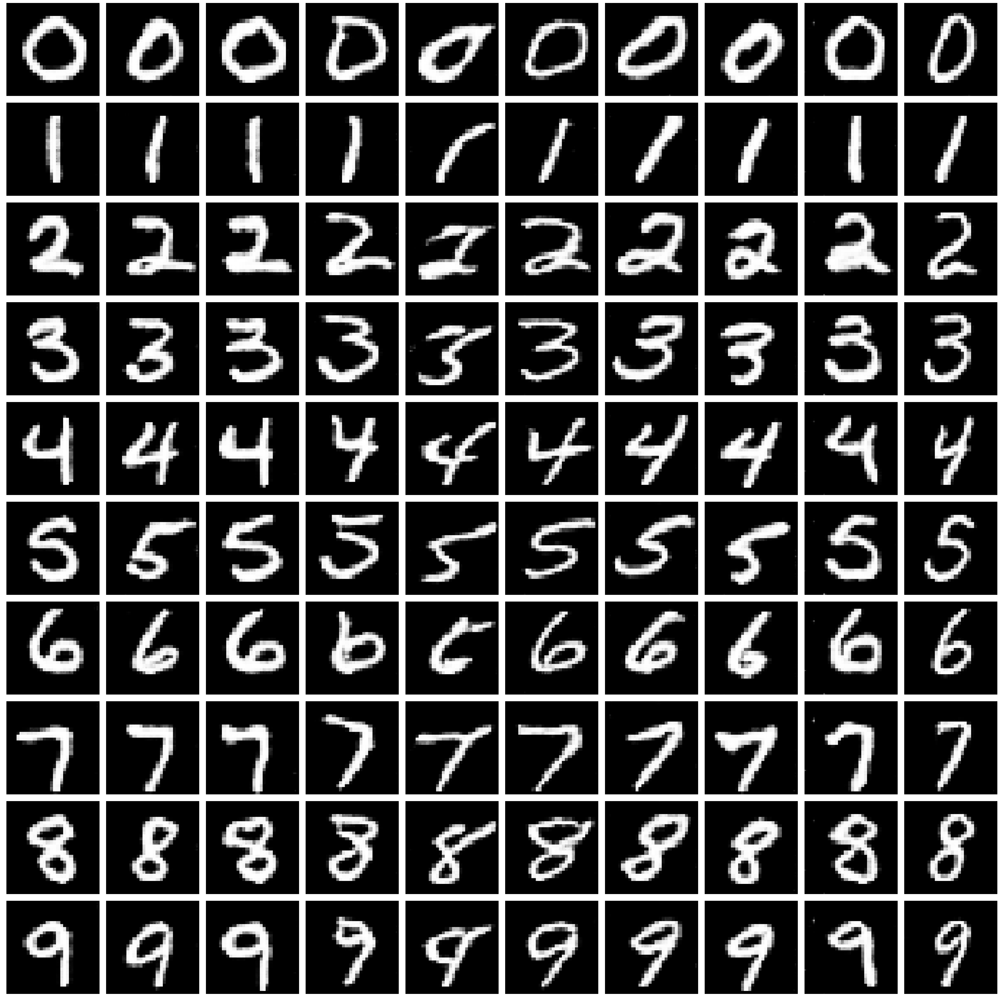

tensorflow-dcgan-mnist
======================

DCGAN
-----------------

# Mnist Result
## Epoch timelapse

<table align='center'>
<tr align='center'>
 <td> Generated image</td>

 </tr>
<tr>
 <td> </td>
</tr>
</table>

<table align='center'>
<tr align='center'>
 <td> Epoch 0 </td>
<td> Epoch 10 </td>
<td> Epoch 20 </td>
 </tr>
<tr>
 <td> </td>
 <td></td>
 <td> </td>
</tr>
</table>

### Enviroment
1. epoch : 20, batch size : 25, learning rate : 0.0002 ,activation fuction : ReLU For 
both (generator, discriminator) net , output activation fuction : Sigmoid, initialization : Glorot initialization

cDCGAN
-----------------

# Mnist Result
## Epoch timelapse

<table align='center'>
<tr align='center'>
 <td> Epoch 0 </td>
 <td> </td>
<td> Epoch 3 </td>
 <td></td>
<td> Epoch 6 </td>
 <td> </td>
 </tr>

</table>

### Enviroment
1. epoch : 6, batch size : 25, learning rate : 0.0002 ,activation fuction : ReLU For 
both (generator, discriminator) net , output activation fuction : Sigmoid, initialization : Glorot initialization

### Reference
1. https://github.com/znxlwm/pytorch-MNIST-CelebA-GAN-DCGAN
2. https://www.tensorflow.org/programmers_guide
3. https://wiki.ncsoft.com/display/cv/Batch+Normalization

